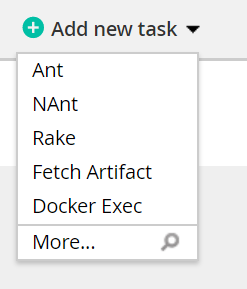
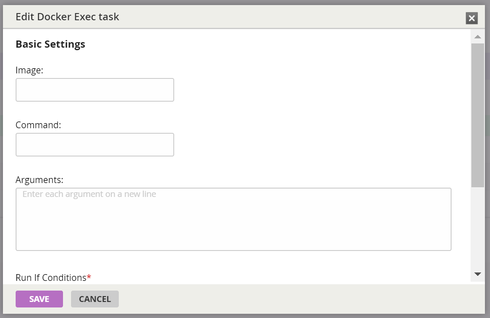

# Go.cd Docker Exec Plugin

Plugin for running build tasks inside a Docker container a la
[Gitlab CI](https://docs.gitlab.com/ce/ci/docker/using_docker_images.html).

## Support

* Go.cd: 17.3.0+ _note_: This is only tested regularly against 17.3.0 and latest. This could potentially work with
  versions back to 14.4.0 (introduction of the message based plugin API), but this is completely untested.
* Agent Requirements: Linux, Docker _note_: This is only tested against the latest Docker stable release and Ubuntu
  16.04.
  
## Installation

This plugin can be installed using
[the standard installation instructions](https://docs.gocd.org/current/extension_points/plugin_user_guide.html).

## Usage

### Agent configuration
1. If docker is not available at the standard `unix:///var/run/docker.sock` location, an alternative URL can be
   specified by setting the Java system property `gocddockerexecplugin.dockerhost`.

### Task configuration
1. Select "Docker Exec" when creating a new task.

   
2. Specify the image to be used, command to be run, and any arguments to the command. Arguments must be specified
   one per line the same as the "More..." task.
   
   

## Issues

For general Q/A please hop on the Gitter channel using the link above. If you have a bug to report, please create
create an issue against this repository. Make sure to use the template provided and provide as much detail as possible
in order to reproduce the issue.

## Contributing

Please note we have a [code of conduct](CODE_OF_CONDUCT.md) that all contributors are required to follow.

Detailed code guidelines/instructions are available [here](CONTRIBUTING.md)
